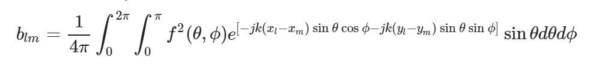

# array-opt
Reimplementation of M.T. Ma's optimal array calculations in C++ using Eigen.

See [this page](https://danzimmerman.com/code/directivity/) for a description and Jupyter notebook prototype.

# Using the Code

Not useful for anything yet, but make sure to run `git submodule update --init --recursive` after clone to pull in the dependencies.

I want this to be a source-only single-build eventually.

# Status

This is a work-in-progress hobby project. Right now I'm researching and deciding which numerical integration scheme to use to compute the matrix elements of the matrix **B**:

 * Simple quadrature with Gauss-Legendre latitude points [Atkinson 1981](http://homepage.divms.uiowa.edu/~atkinson/papers/SphereQuad1982.pdf)
 * Delunay triangulation methods [Carstairs 2015](https://scholarworks.gsu.edu/cgi/viewcontent.cgi?article=1158&context=math_theses)
 * RBF method [Reeger et al. 2016](https://royalsocietypublishing.org/doi/pdf/10.1098/rspa.2016.0401)

This is a common, old problem in electromagnetics, so it's likely I should seek a method there.

